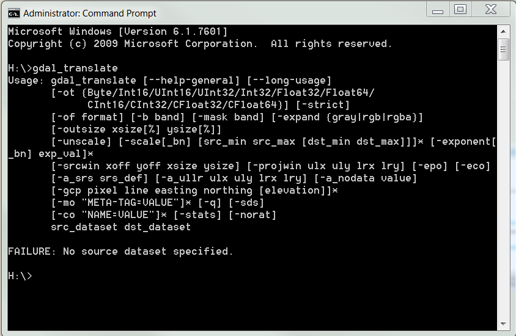
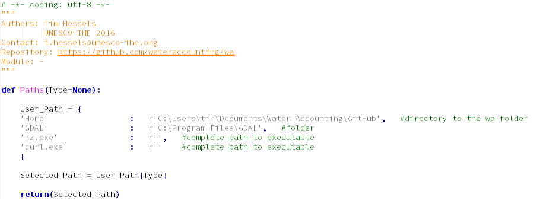

# Water Accounting Plus Toolbox   

_Independent estimates of water flows, fluxes, stocks, consumption, and services_

---

## About WA+

[Water Accounting Plus](http://wateraccounting.org/index.html) is the process of communicating water resources related information and the services generated from consumptive use in a geographical domain, such as a river basin, a country or a land use class; to users such as policy makers, water authorities, managers, etc.

---

## Installation

There are several packages available, which include python. The WA+ team recommends to download the python package of Anaconda. The great advantage of using the standard Anaconda package is that most of the commonly used modules are included in the package. Alternatively, these modules can be installed separately by the user if a different package than Anaconda is preferred.

### Install Anaconda

Anaconda can be downloaded from: [http://continuum.io/downloads](http://continuum.io/downloads). It is recommended to download  the 64 bits version, because this will increase the calculation capacity enormously. However, be sure that your computer/laptop is a 64 bits computer/laptop. 

The WA+ python codes are made for python version 2.7 for Windows operating systems. It is therefore necessary to download this version of python for running WA+ tools. Major changes are made to the python codes and functions if you compare 2.7 with 3+ versions. It is therefore not possible to run WA+ code in python 3+ versions without making some changes to the code.

 

After downloading Anaconda you can run the installation of Anaconda by double-click the executable file and follow the automatic installation steps. Choose a logical location for the installation, a logical location is a directory without spaces and preferably near the root folder (C: or D:). In the remaining of this document this directory will be called $HOME. 
The Anaconda package also includes Spyder, which is the IDE (Integrated Development Environment). This is a layout for writing and running python scripts.

### Install Water Accounting Toolbox

The latest Water Accounting Toolbox can be downloaded from the Water Accounting Plus [Github] (www.github.com/wateraccounting/wa) Account (www.github.com/wateraccounting/wa). Click on the "Clone or download" button located on the top right of the window:

 

After downloading, subtract the data and change the name from "wa-master" into "wa". Copy and paste the complete "wa" folder in the site-packages location of Anaconda ($HOME/Anaconda2/Lib/site-packages). 

### Install necessary executables

In order to run all the Water Accounting Toolbox functions, there are some necessary executables for running the WA+ scripts properly. The necessary to install the following programs:
- **QGIS:** site: [http://www.qgis.org/en/site/forusers/download.html](http://www.qgis.org/en/site/forusers/download.html)
- **7-zip:** site: [http://www.7-zip.org/download.html](http://www.7-zip.org/download.html) (choose: Type = .exe)
- **ImageMagick:** site: [http://www.imagemagick.org/download/binaries/](http://www.imagemagick.org/download/binaries/) (Version: ImageMagick-6.9.7-6-Q8-x64-dll.exe)
- **Curl:** site: [https://curl.haxx.se/download.html](https://curl.haxx.se/download.html) 

This will install the following required executables: 

- **QGIS:** gdal_translate.exe, gdalwarp.exe, gdalbuildvrt.exe
- **7-zip:** 7z.exe
- **ImageMagick:** convert.exe
- **Curl:** curl.exe

They can be found in the file location from where the program is installed. Be sure that the executables can also be found by the computer. This can be checked by typing the name of the executable name without the extension (for QGIS: "gdalwarp", "gdal_translate", "gdalbuildvrt", for 7zip: "7z", for ImageMagick: "convert" , for Curl: "curl") in the command prompt as shown below:

If the executable can not be found, the following message will be shown:

>'..executable_name' is not recognized as an internal or external command. 
>operable program or batch file.

Then you need to manage environment variables of the computer. For an Windows 7 system go to: 
Control panel > System and security > System > Advanced system settings > Advanced > Environment variables. 
This will pops up the window as shown below.

 

Edit the "Path" variable under the system variables box and add the paths of the executables if they are not there yet. Make sure you do not remove the original paths in the "Path" environment. You can separate the paths with a semi-colon (;) sign.

### Set locations in WA_path.py

The path to the "Home" folder needs to be filled. Here you need to define the directory where the "wa" folder is located. See an example below of the WA_path.py:

For gdal_translate.exe, gdalwarp.exe, and gdalbuildvrt.exe it is important that not the executables that are located inside Anaconda are used, because those executables are not linked with a jpeg2000 library resulting that some tools of the Water Accounting Toolbox will not run properly. The GDAL executables from QGIS must be used.

To be sure that the right executables are used (the computer will run the first executable he can find, this is not always the correct one), you can define the path to the GDAL executables (within this directory the gdalwarp.exe, gdal_translate.exe, etc. are located) in the WA_path.py (located in the Water Accounting Toolbox). Also the path to the 7z.exe and curl.exe executables can be defined here, but this is not required when the command prompt is already able to find those executables. If the path is empty than the path found within the systems variable will be used.

### How to install all the necessary Python modules

Modules are tools that can be imported into your python code. They usually contain stand-alone functions, which can be used within your own python code.

In order to import the Water Accounting Toolbox all the modules must be present. This can be checked by running the following line in Spyder:

>import wa

If you get no command everything is fine, else you will see:

>ImportError: No module named ... module name ...

Any missing modules can be installed by using one of the following four methods. 

#### Method 1

If a package is missing, you can search in the anaconda library by starting the command prompt and type:  

>conda install ... module name ...

This will only work if Anaconda is installed. Below is an example of a command to install the "gdal" module by using the Anaconda libary:

 

#### Method 2

You can also use the following command in the command prompt to install a module:

>pip install ... module name ...

Below is an example of a command to install the "pyproj" module by using the pip libary:

 

#### Method 3

It is also possible to install a module by using a .whl file (wheel-file). The wheels can be downloaded here: [http://pythonwheels.com/](http://pythonwheels.com/) and [http://www.lfd.uci.edu/~gohlke/pythonlibs/](http://www.lfd.uci.edu/~gohlke/pythonlibs/). Select the wheel containing win32 within the name if a 32 bits version of Python is used, and win_amd64 if the 64 bits version is used. After downloading the module wheel file, open command prompt and change the directory to the directory where the .whl file is located. You can change the directory in command prompt by using the cd command, as shown in the example below. 

 

After changing the directory, use the following command within the command prompt to install the module.

>pip install ... name.whl ... 

#### Method 4

If a module consists of a complete folder with a setup.py script inside after unzipping, the module can be installed by opening the command prompt and change the directory ("cd" command) to the path where the setup.py is located. Then you can install the module by using the following command within the command prompt:

>python setup.py install

---

## Functions

---

## Troubleshoot

jpeg2000 library missing (gebruik niet de gdal functies in anaconda omdat deze library hierin mist)
datum.csv  (gdal_data toevoegen)

---

>>>>>>> origin/master
