# Water Accounting Plus Toolbox  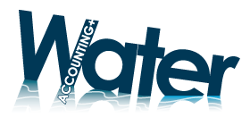 

_Independent estimates of water flows, fluxes, stocks, consumption, and services_

---
## Content

1. [Content](#Content)
2. [About WA+](#chapter1)
3. [Introduction WA+ Toolbox](#chapter2)
4. [Installation](#chapter3)
	1. [Step 1: Install Anaconda](#chapter3_1)
		1. [Method 1: Install Anaconda from Continuum](#chapter3_1_1)
		2. [Method 2: Install Anaconda from WA+ FTP server](#chapter3_1_2)
	2. [Step 2: Get the Water Accounting Toolbox from Github](#chapter3_2)
	3. [Step 3: Install GDAL, 7zip, and InkScape](#chapter3_3)
		1. [Install GDAL or QGIS](#chapter3_3_1)
		2. [Install 7-zip](#chapter3_3_2)
		3. [Install InkScape](#chapter3_3_3)	
 	4. [Step 4: Install all the python modules](#chapter3_4)
		1. [Method 1: conda](#chapter3_4_1)
		2. [Method 2: pip](#chapter3_4_2)
		3. [Method 3: wheel](#chapter3_4_3) 
		4. [Method 4: python file](#chapter3_4_4) 		 
 	5. [Step 5: Add Environment Variables](#chapter3_5)
 	6. [End Installation](#chapter3_6)
5. [Create Accounts for WA+ Toolbox](#chapter4)
	1. [Account 1: WA+ FTP](#chapter4_1)
	2. [Account 2: NASA](#chapter4_2)
	3. [Account 3: GLEAM](#chapter4_3)
	4. [Account 4: MSWEP](#chapter4_4)

---
## About WA+

[Water Accounting Plus](http://wateraccounting.org/index.html) is the process of communicating water resources related information and the services generated from consumptive use in a geographical domain, such as a river basin, a country or a land use class; to users such as policy makers, water authorities, managers, etc.

---

## Introduction WA+ Toolbox

The water accounting toolbox is a set of open access functions that can be used to collect data, process data, and to create the water accounting plus maps, csv, and sheets. This memo describes first how to install the water accounting toolbox. Hereafter the functions to collect, process, and calculations of the water accounting plus sheets will be shown.

---

## Installation

To install the water accounting toolbox the following steps are needed:

*	**Step 1:** Install Anaconda (64 bits and python 2.7 version)
*	**Step 2:** Get the Water Accounting Toolbox from Github
*	**Step 3:** Install Inkscape, 7zip, and GDAL
*	**Step 4:** Install all the python modules
*	**Step 5:** Set the environment variables

The steps mentioned above will be described one by one below.

---

### Step 1: Install Anaconda

There are several packages available, which include python. The WA+ team recommends to download the python package of Anaconda. The great advantage of using the standard Anaconda package is that most of the commonly used modules are included in the package and also a IDE is included (Spyder). Alternatively, these modules can be installed separately by the user if a different package than Anaconda is preferred.

This manual will describe two different method to install Anaconda:

* **Method 1**: Download the latest version of Anaconda from Continuum website
* **Method 2**: Download the same version as the WA+ team from the WA+ FTP server

The Advantage of method 2 is that you don't need to install all the specific modules that are needed for running the WA+ toolbox manually one by one. On our FTP server the Anaconda python module library that the WA+ team is using is also stored on the FTP server.

#### Method 1: Install Anaconda from Continuum

The Anaconda executable can be downloaded from: [http://continuum.io/downloads](http://continuum.io/downloads). It is recommended to download the **64 bits version**, because this will increase the calculation capacity enormously. However, be sure that your computer/laptop is a **64 bits computer/laptop. Otherwise, install the 32 bits version.

The WA+ python codes are made for **python version 2.7** for Windows operating systems. It is therefore necessary to download this version of python for running WA+ tools. Major changes are made to the python codes and functions if you compare 2.7 with 3+ versions. It is therefore not possible to run WA+ code in python 3+ versions without making some changes to the code.

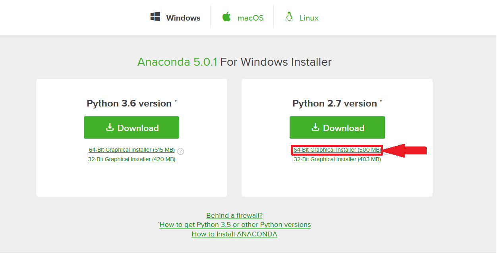 

After downloading Anaconda you can run the installation of Anaconda by double-click the executable file and follow the automatic installation steps. Choose a logical location for the Anaconda main directory, a logical location is a directory without spaces and preferably near the root folder (C: or D:). In the remaining of this document this directory will be called $HOME.
 
The Anaconda package also includes Spyder, which is the IDE (Integrated Development Environment). This is a layout for writing and running python scripts.

#### Method 2: Install Anaconda from the WA+ FTP server

The installation executable can be found on the WA Guest FTP server. The required address, username, and password is shown below:

* **Adress:**		ftp.wateraccounting.unesco-ihe.org
* **Username:**		wateraccountingguest
* **Password:**		W@t3r@ccounting

After login go to /WaterAccounting_Guest/Programs/WA_Toolbox/Anaconda. Here you can find two executable files. One for a 32-bits computer (Anaconda2-4.3.1-Windows-x86.exe) and one for a 64-bits computer (Anaconda2-4.3.1-Windows-x86_64.exe). It is recommended to use the 64-bits version if your system allows. 

Download and install this anaconda executable (recommended to install this directly in the C: folder, the executable will create after installation a map called C:/Anaconda2).

---

### Step 2: Get the Water Accounting Toolbox from Github

The latest Water Accounting Toolbox can be downloaded from the Water Accounting Plus [Github] (www.github.com/wateraccounting/wa) Account (www.github.com/wateraccounting/wa). Click on the "Clone or download" button located on the top right of the window:

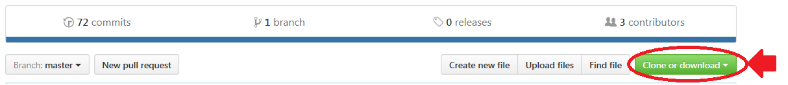 

After downloading, subtract the data and change the name from "wa-master" into "wa". Copy and paste the complete "wa" folder in the site-packages location of Anaconda ($HOME/Anaconda2/Lib/site-packages). 

---

### Step 3: Install GDAL, 7zip, and Inkscape

In order to run all the Water Accounting Toolbox functions, there are some necessary executables for running the WA+ scripts properly. It is necessary to install the following programs if needed:

* 1. GDAL (only needed when QGIS is not installed)
* 2. 7-zip
* 3. InkScape

This will install the following required executables: 

- **GDAL:** gdal_translate.exe, gdalwarp.exe, gdalbuildvrt.exe, etc.
- **7-zip:** 7z.exe
- **InkScape:** inkscape.exe

The GDAL package is a geoprocessing toolbox that is also included in QGIS. If QGIS is installed it is not needed to install GDAL.

Those programs can be installed by using one of the following methods:

* **Method 1:** Go the the developers site, download and install the executable
* **Method 2:** Go the the WA+ FTP server, and download and install the same executable file as the WA+ team is using

For every program both methods are described.

#### Install GDAL or QGIS
 

The GDAL executable is only required when no QGIS is installed on the computer. If QGIS is not installed a GDAL packages is needed. This can be installed by installing only the GDAL package or the complete QGIS packages. Probably the installation of the complete QGIS is the easiest way. Therefor, this QGIS installation is recommended and the stand alone GDAL installation procedure that is described in this chapter can be ignored. Both executable files can be found on the developers webpage (method 1) or the WA+ FTP server (method 2):

**Method 1:**

For the stand alone GDAL installation procedure download the GDAL package from here:

* **GDAL:** site: [http://www.gisinternals.com/release.php](http://www.gisinternals.com/release.php)

Two executable files are needed. One is the core executable and the other is the GDAL package. The exact executable that needs to be downloaded and the installation procedure is explained later in this chapter.

An easier way to install GDAL is to download the complete QGIS program from here:

* **QGIS:** site: [https://www.qgis.org/en/site/forusers/download.html](https://www.qgis.org/en/site/forusers/download.html)

**Method 2:**

The executable files for the stand alone GDAL or the complete QGIS package can also be found on the WA+ FTP server, the same executables are used by the WA+ team. 

**For GDAL executables go to:** ftp://ftp.wateraccounting.unesco-ihe.org/WaterAccounting_Guest/Programs/WA_Toolbox/GDAL/

**For QGIS executable go to:** ftp://ftp.wateraccounting.unesco-ihe.org/WaterAccounting_Guest/Programs/WA_Toolbox/QGIS/

The QGIS program only includes one executable, which can be installed by just opening the executable and follow the installation procedure.

For the stand alone GDAL program there are two executable files needed. To see which executable file is required open the python program within the command prompt by opening the command prompt and type "python". 

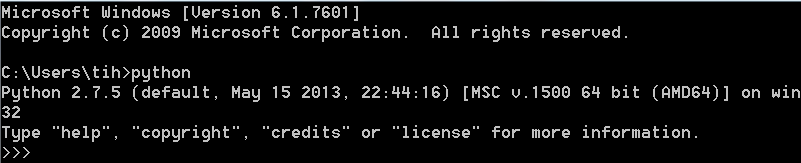

The image above demonstrates the expected output, which shows the python version. In this case the python version is MSC v.1500 64 bit. Now the python version is known, go to [http://www.gisinternals.com/release.php](http://www.gisinternals.com/release.php) and open the tab corresponding to your python version (in case of picture: for picture: release-1500-x64-gdal-2-1-3-mapserver-7-0-4). 

Download the GDAL core components (gdal-201-1500-x64-core.msi) and the python bindings (GDAL-2.1.3.win-amd64-py2.7.msi) corresponding to the python version. Install the core component first and hereafter the python bindings. Now you will find the GDAL folder in your Program Files.

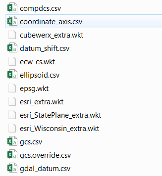

In order to find all the properties of the different projections an environment variable must be checked and created if needed. Search within the environment variable for the GDAL_DATA variable name. If this is already there you do not need to create this variable. 
For more explanation about adding an environment user variable go to the [Add Environment Variable](#chapter3_5) chapter within this document. If not, create this variable:

The directory of the variable consists of files as shown on the right. If GDAL is installed, this folder can be found somewhere here “C:\Program Files\GDAL\gdal-data”. So create the following environment variable (**do not place a semi column at the end of the variable value**):

>GDAL\_DATA >> $HOME\Program Files\GDAL\gdal\_data

If QGIS is installed, this folder can be found somewhere here “$HOME\Program Files\QGIS 2.xx\share\epsg\_csv”. So create the following environment variable (**do not place a semi column at the end of the variable value**):

>GDAL\_DATA >> $HOME\Program Files\QGIS 2.xx\share\epsg\_csv

#### Install 7-zip

 

Before installing, check if the 7z.exe can be found by the computer. This can be done by typing "7z" in the command prompt.
If the executable cannot be found, the following message will be shown:

>'7z' is not recognized as an internal or external command. 
>operable program or batch file.

Than installation is needed. Go the the developers webpage (method 1) or the WA+ FTP (method 2):

**Method 1:**

Download the 7-zip executable from here:

- **7-zip:** site: [http://www.7-zip.org/download.html](http://www.7-zip.org/download.html) (choose: Type = .exe)

**Method 2:**

The 7zip executables can also be found here: “ftp://ftp.wateraccounting.unesco-ihe.org//Programs//WA_Toolbox//7zip”.

 For a 32-bits computer download and install “7z1604.exe” and for a 64-bits computer download and install “7z1604-x64.exe”

After downloading the executable by using method 1 or 2, install the executable on your computer.

Check if the "7z" command can be found in the command prompt by typing "7z" in the command prompt. If this error is still showing:

>'7z' is not recognized as an internal or external command. 
>operable program or batch file.

This error can be solved by editing the "path" environment user parameter by adding the directory to the 7z.exe:

User variables:
>Path >> $HOME\Program Files\7-Zip

For more explanation about adding an environment user variable go to the [Add Environment Variable](#chapter3_5) chapter within this document.

### Install InkScape

 

To create the Water Accounting sheets a program called InkScape is needed to create the PDF's. 

Download the 64-bits executable (Inkscape-0.92.1-x64-1.exe) or 32-bits executable (inkscape-0.92.2-x86.exe) depending on your system. The executable files can be downloaded from the developers webpage:

- **InkScape:** site: [https://inkscape.org/en/release/0.92.2/windows/](https://inkscape.org/en/release/0.92.2/windows/)

Or from the WA+ FTP server: ftp://ftp.wateraccounting.unesco-ihe.org/WaterAccounting_Guest/Programs/WA_Toolbox/Inkscape/

After downloading, install the executable on your computer.

---

### Step 4: Install all the python modules

Python modules are function packages that can be imported into your python code. They usually contain stand-alone functions, which can be used within your own python code.

In order to import the Water Accounting Toolbox all the modules used in this toolbox must be present. This can be checked by running the following line in Spyder:

>import wa

If you get no command everything is fine, if not you will see:

>ImportError: No module named ... module name ...

The missing modules needs to be added manually. The missing module name (that is showing in the ImportError message of python) can be copied (the only exception is "shapefile", this module is called "pyshp") and installed by using one of the following 4 methods, the easiest methods are method 1 and 2 which must also be sufficient to install all the python modules of the WA+ toolbox. After installing one module, close and re-open an Ipython console and check if "import wa" can be imported or to see which new module is missing.

#### Method 1: conda

If a package is missing, you can search in the anaconda library by starting the command prompt (in newer Anaconda versions open the Anaconda prompt, within the normal command prompt the "conda" command will not be found) and type:  

>conda install ... module name ...

This will only work if Anaconda is installed. Below is an example of a command to install the "gdal" module by using the Anaconda library:

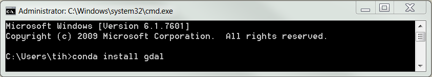 

#### Method 2: pip

You can also use the following command in the command prompt to install a module:

>pip install ... module name ...

Below is an example of a command to install the "pyproj" module by using the pip libary:

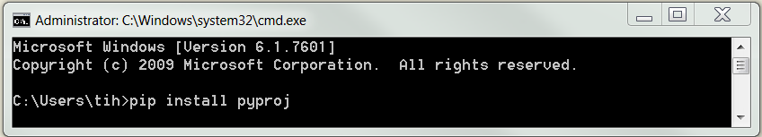 

#### Method 3: wheels

It is also possible to install a module by using a .whl file (wheel-file). The wheels can be downloaded here: [http://pythonwheels.com/](http://pythonwheels.com/) and [http://www.lfd.uci.edu/~gohlke/pythonlibs/](http://www.lfd.uci.edu/~gohlke/pythonlibs/). Select the wheel containing win32 within the name if a 32 bits version of Python is used, and win_amd64 if the 64 bits version is used. After downloading the module wheel file, open command prompt and change the directory to the directory where the .whl file is located. You can change the directory in command prompt by using the cd command, as shown in the example below. 

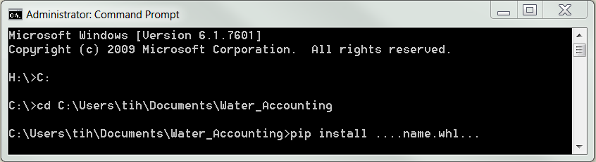 

After changing the directory, use the following command within the command prompt to install the module.

>pip install ... name.whl ... 

#### Method 4: python file

If a module consists of a complete folder with a setup.py script inside after unzipping, the module can be installed by opening the command prompt and change the directory ("cd" command) to the path where the setup.py is located. Then you can install the module by using the following command within the command prompt:

>python setup.py install

---

### Step 5: Add Environment Variables

To add an environment variable, go to the environment variables manager of the computer. For a Windows 7 system go to: 
Control panel > System and security > System > Advanced system settings > Advanced > Environment variables. 
This will pops up the window as shown below.

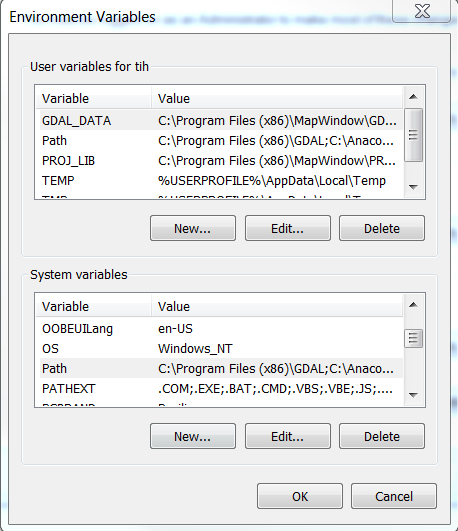 

If an executable cannot be found by the computer (within the command prompt), you need to add a directory in the "Path" environment variable. Do the adding and editing of a environment variable within the user variables (the box on the top). This can be done by clicking on the "Edit" button below the first box when the "Path" variable under the user variables box is selected. Add the directory where the executables are located and make sure that you do not remove the original paths in the "Path" environment. You need to separate the paths with a semi-colon (;) sign. **Be careful in editing this line, removing important paths can harm the system.**

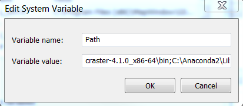

#### Create WA environment variable

For the WA Toolbox two environment variables needs to be created. This can be done in the user environment variables manager by clicking on the "New.." button(see figure below).

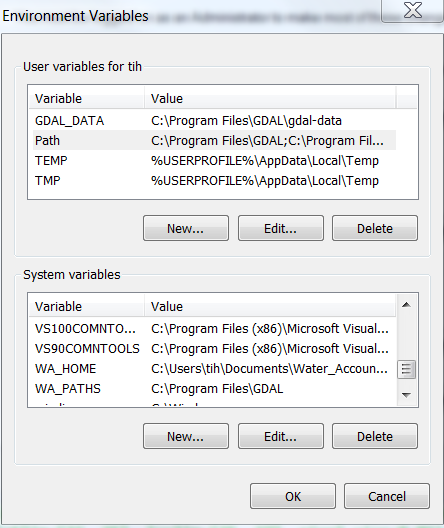 

#### Create WA environment variable

The environment variables that must be created are for the Water Accounting Toolbox the following two:

**Path 1:**

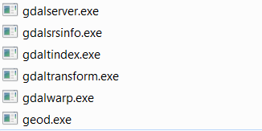

Search for the folder where the GDAL executables like gdalwarp.exe, gdal_translate.exe etc. (see picture on the right) can be found (**Do not use the GDAL executables that are stored in the Anaconda2 folder**). If you installed GDAL you will find the executables as showni n the picture on the right somewhere in this directory: “$HOME\Program Files\GDAL” if GDAL is installed. Than create the following user variable: 

> WA_PATHS >> $HOME/Program Files/GDAL

If QGIS is installed those executables are in “$HOME\Program Files\QGIS 2.xx\bin”, so the following user environment variable must be created:

> WA_PATHS >> $HOME\Program Files\QGIS 2.xx\bin

**Put after the Variable Value a semi-column (;). Because a second path will be added here.**

Search now for the Inkscape.exe. This file is stored in the main folder that is created after installing Inkscape. On default this folder can be found here: $HOME\Program Files\Inkscape. 

Add this path as second variable value for the WA_PATHS:
> WA_PATHS >> $HOME/Program Files/GDAL;$HOME/Program Files/Inkscape
 
**Path 2:**

The calculations of the Water Accounting Toolbox are performed in the WA Home folder. Within this location all the output will be stored and also the input must be stored in this folder. So create a folder somewhere on your computer and define this folder here as follows:

Variable name >> Variable Value
WA_HOME >> $Path_To_Your_WA_HOME_folder

Make sure that there is enough space available to store all the water accounting outputs.

### End Installation

After fulfilling the 5 steps above, the Water Accounting Toolbox is installed. The functions that are within the toolbox can be used and the datasets that don't need authentication can be downloaded. For MODIS, TRMM, GLEAM, WA+ products authentication is required. To collect those dataset automatically an free account is needed that can be created by setting an request the developers for permission or create an account online. 
The steps that must be taken and accounts that must be created are described in the [Create Accounts for WA+ Toolbox](#chapter4) section of this manual.

---

## Create Accounts for WA+ Toolbox

In the Water Accounting Toolbox functions are available to download data automatically, but some datasets requires an account in order to get the data from their server.

 Within the WebAccounts.py file located in the Water Accounting Plus Toolbox directory ($HOME/Anaconda2/Lib/site-packages/wa) the accounts can be specified. Open this file in notepad (see picture on the right).

Behind the name the username and password can be specified. Between the first apostrophes the username needs to be specified between second apostrophes the password needs to be defined. 

---

### Account 1: WA+ FTP

**Required for:** ETensemble

In order to download ETensemble data from the WA+ FTP server. The username and password need to be filled in within the WebAccounts.py under the FTP_WA section. The username and password is for guest the following:

* **Username:**		wateraccountingguest
* **Password:**		W@t3r@ccounting

After fullfilling this step the WebAccounts.py file looks like the image below:

 

---

### Account 2: NASA

**Required for:** GLDAS, MOD9, MOD11, MOD12, MOD13, MOD15, MOD16, MOD17, TRMM

To download TRMM, GLDAS, and MODIS data a earthdata account from NASA is needed. This account can be created here: [https://urs.earthdata.nasa.gov/users/new](https://urs.earthdata.nasa.gov/users/new).

 

After the account has been created, login into the earthdata server by using this account: [https://urs.earthdata.nasa.gov/home](https://urs.earthdata.nasa.gov/home)

Go to the "My Applications" tab and check if all the required applications (see picture below) are approved. If one is missing click on the "APPROVE MORE APPLICATIONS" button and search and approve the missing applications. 

 

---

### Account 3: GLEAM

**Required for:** GLEAM

To get the account for the GLEAM dataset, go to [www.gleam.eu](https://www.gleam.eu/). Scroll down to the Download section and fill in your e-mail. After a couple minutes a mail with the login details will be send to this adress. The username and password can be filled in within the WebAccounts.py under the GLEAM section. 

 
---

### Account 4: MSWEP

**Required for:** MSWEP

The MSWEP account can be created here: [www.gloh2o.org](http://www.gloh2o.org/). Go to the DATA ACCESS section and fill in the web form. After a couple days an e-mail is send with the your account. Fill in the username and password under the MSWEP section in the WebAccounts.py file. 

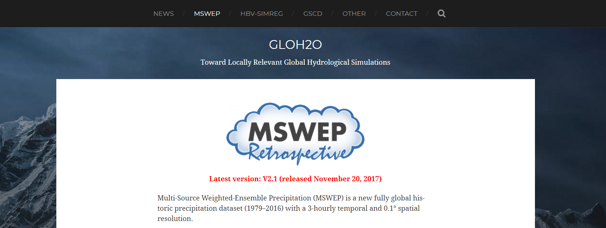 

---

---

## Functions

---

## Troubleshoot

jpeg2000 library missing (gebruik niet de gdal functies in anaconda omdat deze library hierin mist)
datum.csv  (gdal_data toevoegen)

---

>>>>>>> origin/master
